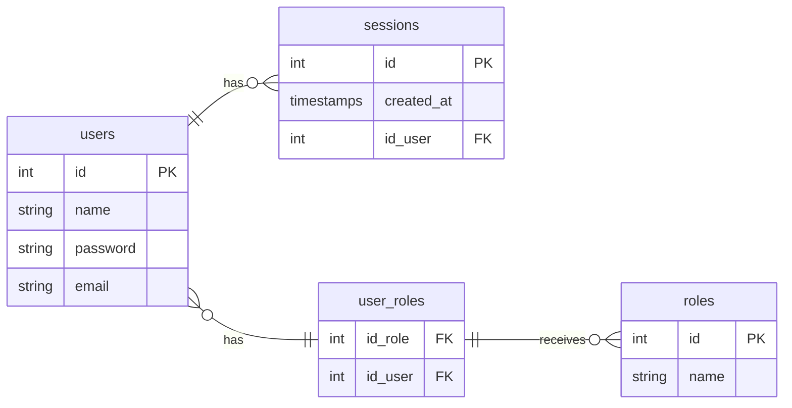

# ERD Auth Flow

```mermaid
erDiagram
  direction LR
  users ||--o{ sessions : has
  users }o--|| user_roles : has
  user_roles ||--o{ roles   : receives
  users{
    int id PK
    string name
    string password
    string email
  }
  user_roles{
    int id_role FK
    int id_user FK
  }
  roles {
    int id PK
    string name
  }
  sessions {
    int id PK
    timestamps created_at
    int id_user FK
  }
```
