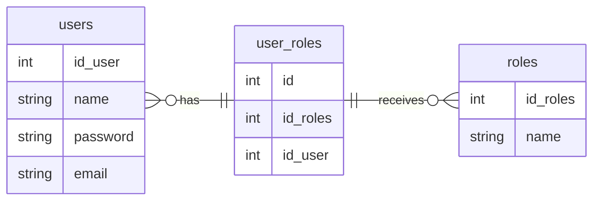

# ERD Auth Flow

```mermaid
erDiagram
  direction LR
  users }o--|| user_roles : has
  user_roles ||--o{ roles   : receives
  users{
    int id_user
    string name
    string password
    string email
  }
  user_roles{
    int id
    int id_roles
    int id_user
  }
  roles {
    int id_roles
    string name
  }
```
